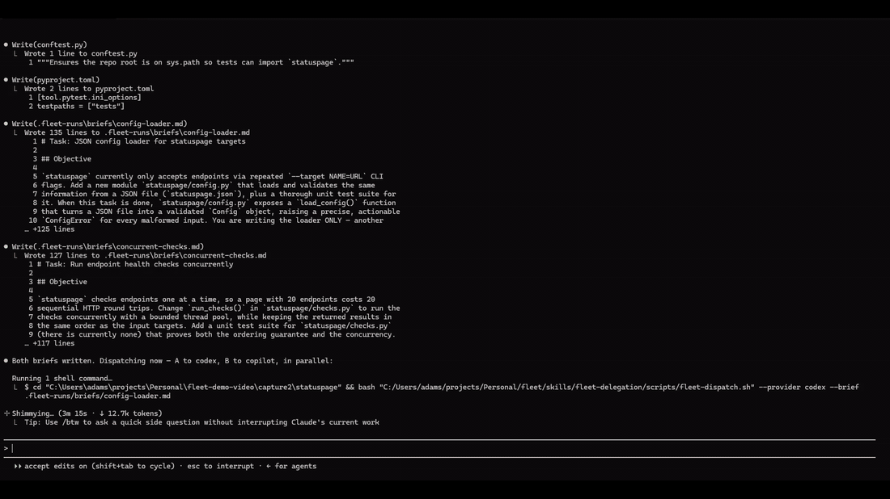

# fleet

An **agent-portable skill** (plus a Claude Code plugin wrapper) that turns your
coding agent into the supervisor of a **multi-provider fleet** of AI coding
workers. The supervisor stays the planner, architect, router, and reviewer;
well-specified implementation work runs in the background on whichever worker
is best suited and cheapest — OpenAI Codex, Google Antigravity CLI (Gemini
CLI's successor), xAI Grok Build, Cursor CLI, GitHub Copilot CLI, Qwen Code,
Factory Droid, Amp, Claude Code headless, or any of 75+ providers via
OpenCode, including DeepSeek, Kimi, GLM, and local models served by LM Studio
or Ollama.

The skill follows the [Agent Skills open standard](https://agentskills.io)
(SKILL.md), so the **same skill folder works under Claude Code, Codex CLI,
Gemini CLI, Cursor, and other compatible agents** — any of them can be the
supervisor, and thanks to the `claude` adapter, Claude Code is also a
dispatchable worker. Claude Code additionally gets a plugin wrapper with
`/dispatch`, `/fleet-status`, and `/fleet-init` commands.

> ## ⚠️ Read this before installing
>
> This plugin runs **autonomous background agents in your repository — from
> multiple providers, in parallel.** When Claude delegates a task, it launches
> a worker CLI headlessly with auto-approved tool execution: Codex with
> `--sandbox workspace-write`, Antigravity with
> `--dangerously-skip-permissions`, Gemini with `--approval-mode yolo`,
> OpenCode per your permissions config. Concretely, workers can **edit files and run
> commands inside your project directory without asking you first**, while
> Claude works on other things. With API-billed providers enabled, delegation
> also **spends real money**.
>
> Mitigations built in: workers only run inside git repositories so every
> change is reviewable via `git diff` before commit; workers are briefed never
> to commit (Claude reviews and commits); sandboxes/permissions are never
> escalated by Claude; every dispatch is announced with provider, model, and
> reasoning; per-provider `trust` levels restrict what smaller models may
> touch; costs are surfaced per task via the ledger; and Claude must verify
> results against the brief's acceptance criteria before accepting them.
>
> Even so: **only use this in repositories you trust**, don't point it at
> repos containing untrusted code, review diffs before committing, and only
> enable providers whose billing you understand. If you are not comfortable
> with unattended agents modifying your working tree, do not install this.

## Demo

One prompt asking for four things. The supervisor reads the repo, writes two
self-contained briefs, dispatches them to **Codex and Copilot in parallel**,
re-runs each brief's acceptance commands itself, and keeps the two tasks that
needed judgment.



**Full walkthrough (3:36)** — the same session with the brief, the worker's own
log, and the ledger shown alongside it:
[`fleet-demo.mp4`](https://github.com/adam-N-singh/fleet/releases/latest) ·
also available as an unedited terminal recording,
[`fleet-demo-plain-terminal.mp4`](https://github.com/adam-N-singh/fleet/releases/latest).

Everything on screen is a real run against a real five-provider registry.
What it produced, verified independently afterwards:

| task | routed to | outcome |
|---|---|---|
| JSON config loader + 29 tests + CLI wiring | `codex` | accepted · 8m15s |
| Concurrent `run_checks` + 9 tests | `copilot` | accepted · first pass |
| README usage docs | *kept* | depends on both workers landing first |
| Incident-history storage | *kept* | open-ended design — never delegated |

51 tests pass. Nothing was committed by a worker. Both providers were on
flat-rate subscriptions, so the per-token rung was never touched.

## What it does

- **Registry-driven fleet knowledge.** A user-owned `providers.json` describes
  what you actually have access to: adapter, access mode (subscription / API /
  free tier / local), models, costs, strengths and weaknesses, concurrency
  caps, trust levels. `/fleet-init` interviews you and web-researches current
  models and pricing to draft it — fleet knowledge is never fossilized in a
  prompt.
- **Intelligent routing.** For each delegable task Claude filters by
  capability, then walks a cheapest-first cost cascade (local free →
  subscription flat → cheap API → expensive API), then checks availability,
  then consults the **outcome ledger** — observed success rates per
  provider/model/task-type from your actual usage. Routing gets smarter every
  week you use it.
- **Parallel execution and supervision.** Workers launch as background
  processes with per-provider and global concurrency caps. Claude dispatches,
  keeps working, checks in between its own tasks, and classifies each worker
  as RUNNING / DONE / FAILED / RATE_LIMITED / AUTH_ERROR / INCOMPLETE.
- **Quota pacing and true-cost visibility.** Optional per-provider
  `soft_weekly_cap` values let the supervisor deprioritize a flat-rate
  provider *before* it hits invisible subscription limits (`ledger.py usage`),
  preserving frontier quota for the work that needs it. `ledger.py dashboard`
  shows spend by provider by day, and the ledger books wasted spend from
  misroutes (plus redo costs) so cheap-but-flaky providers surface at their
  true cost-to-merge, not their sticker price. A `review_after` date field
  flags providers whose access terms are scheduled to change.
- **Cascade fallback.** A rate-limited provider gets an automatic cooldown and
  the brief re-routes to the next capable provider; Claude absorbs the task
  itself only when no provider remains. No provider outage blocks the build.
- **Verification-gated acceptance.** "DONE" is a claim, not evidence: git diff
  review + the brief's acceptance commands (+ the `verification-gate` skill if
  installed) before anything is accepted. Remediation resumes the same worker
  session where supported (Codex, OpenCode).

## Requirements

- Any Agent Skills-compatible supervisor: Claude Code, Codex CLI, Gemini CLI,
  Cursor, OpenCode, and others; `git`, `bash`, `python3`
- At least one worker CLI installed and authenticated:
  - **Codex CLI** (`codex login`) — OpenAI, subscription or API
  - **Antigravity CLI** (`agy`, Google login or `GEMINI_API_KEY` /
    `ANTIGRAVITY_API_KEY`) — Google's Gemini CLI successor
  - **Gemini CLI** — ⚠️ retired 2026-06-18 for free/AI Pro/Ultra accounts;
    only enterprise Gemini Code Assist licenses still work
  - **Grok Build CLI** (`grok login`) — xAI, SuperGrok / X Premium+
  - **Cursor CLI** (`cursor-agent login` or `CURSOR_API_KEY`) — Cursor plans
  - **GitHub Copilot CLI** (`copilot` login or `GH_TOKEN`) — Copilot plans
  - **Qwen Code** (API key or Qwen Coding Plan) — Alibaba Qwen models
  - **Factory Droid** (`FACTORY_API_KEY`) — Factory platform, usage-billed
  - **Amp** (`amp login` or `AMP_API_KEY`) — ampcode.com, usage-billed
  - **Claude Code** (`claude /login`) — as a worker, on any account/model
  - **OpenCode** (`opencode auth login` per provider) — everything else,
    including local models

## Install

### Easiest: one command

No checkout needed — the installer fetches the repo itself, detects which
agents you have installed (Claude Code, Codex, Gemini CLI, Antigravity), and
installs for each. For Claude Code it installs the full plugin, slash commands
included.

macOS / Linux:

```bash
curl -fsSL https://raw.githubusercontent.com/adam-N-singh/fleet/main/install.sh | bash
```

Windows (PowerShell):

```powershell
irm https://raw.githubusercontent.com/adam-N-singh/fleet/main/install.ps1 | iex
```

### Or: paste one prompt into your AI agent

Works in Claude Code, Codex, Gemini CLI, Cursor, or any coding agent — copy
the whole block:

```text
Install the "fleet" skill from https://github.com/adam-N-singh/fleet for me.
Before installing, fetch the repo's README, show me its "Read this before
installing" warning, and get my explicit go-ahead. Then:
- If you are Claude Code, run: claude plugin marketplace add adam-N-singh/fleet
  and then: claude plugin install fleet@fleet-marketplace
- Otherwise, clone the repo and run its installer for the agent you are
  (macOS/Linux: bash install.sh codex|gemini|antigravity; Windows PowerShell:
  .\install.ps1 <same targets>). If you are a different Agent Skills-compatible
  agent, run the installer with --dir <your skills directory> instead.
Verify the installed skill's SKILL.md exists. Then read the skill's
references/providers-guide.md and interview me to create my provider registry
at ~/.fleet/providers.json, and validate it by running:
python scripts/registry.py validate (from the installed skill directory).
```

### Manual install

**Claude Code (richest experience — adds the slash commands):**

```
/plugin marketplace add adam-N-singh/fleet
/plugin install fleet@fleet-marketplace
```

**Codex CLI / Gemini CLI / Antigravity / anything else** — the skill alone is
fully functional; supervisors without the commands are simply *asked* ("set up
my fleet registry", "dispatch the test suite to gemini", "check on the fleet"):

```bash
git clone https://github.com/adam-N-singh/fleet.git && cd fleet
./install.sh                # -> auto-detect installed agents, install for each
./install.sh codex          # -> ~/.codex/skills/fleet-delegation
./install.sh gemini         # -> ~/.gemini/skills/fleet-delegation
./install.sh antigravity    # -> ~/.gemini/antigravity/skills/fleet-delegation
./install.sh --dir <path>   # any other agent's skills directory
./install.sh <target> --project   # project-level instead of user-level
```

**Windows:** PowerShell doesn't execute `.sh` files (it opens them in your
editor). Either run the bash installer through Git Bash — `bash ./install.sh
codex` — or use the native PowerShell installer: `.\install.ps1 codex`
(same targets, `-Dir <path>`, `-Project`). Claude Code users can skip
installers entirely: `/plugin marketplace add <path-or-repo>` works with a
local folder path. Runtime requirements on Windows: Git for Windows (the
skill's scripts run under Git Bash at dispatch time) and Python on PATH —
plain `python` is fine, the scripts fall back automatically when `python3`
doesn't exist (override with `FLEET_PYTHON`).

Skill directory locations vary by agent version — if the agent doesn't
discover it, check that agent's skills docs and rerun with `--dir`. Then have
the supervisor create your provider registry (Claude Code: `/fleet-init`;
others: "read the fleet-delegation skill's providers-guide and set up my
registry"). Add `.fleet-runs/` to your project's `.gitignore` (the skill also
does this on first dispatch).

## Usage

The `fleet-delegation` skill triggers on its own during multi-task builds;
the supervisor announces every dispatch with provider, model, and reasoning.
Claude Code manual controls (other agents: just ask in natural language):

- `/dispatch <task> [on <provider>]` — explicitly delegate (skips the rubric)
- `/fleet-status [task-id]` — check workers across all providers
- `/fleet-init` — create or refresh the provider registry

## Configuration

Registry: `$FLEET_PROVIDERS` → `./.fleet/providers.json` →
`~/.fleet/providers.json`. Schema in
`skills/fleet-delegation/references/providers-guide.md`; starter in
`skills/fleet-delegation/config/providers.example.json`.

| Env var | Default | Meaning |
|---|---|---|
| `FLEET_RUNS_DIR` | `.fleet-runs` | Bookkeeping (briefs, logs, pids, ledger) |
| `FLEET_MAX_WORKERS_TOTAL` | `4` | Global concurrency cap (per-provider caps live in the registry) |
| `FLEET_COOLDOWN_SECONDS` | `900` | Per-provider cooldown after a rate limit |
| `FLEET_CODEX_SANDBOX` | `workspace-write` | Codex sandbox mode |
| `FLEET_ANTIGRAVITY_PRINT_TIMEOUT` | `45m` | Antigravity `--print-timeout` (agy's own default of 5m is too short for coding tasks) |
| `FLEET_ANTIGRAVITY_SANDBOX` | (unset) | Set to `1` to pass `--sandbox` to Antigravity workers |
| `FLEET_LEDGER` | `.fleet-runs/ledger.jsonl` | Outcome ledger path |
| `FLEET_PROVIDERS` | (search order above) | Explicit registry path |

## Per-provider setup notes

- **Codex:** works out of the box once `codex login` is done. Resume supported.
- **Antigravity:** requires `agy` **>= 1.1.1** (earlier versions hang on
  stdin in subprocesses, and 1.0.0 silently dropped stdout under a non-TTY —
  if a worker reports DONE with an empty FINAL_MESSAGE, check `agy --version`
  first). Headless prints **one plain-text response** at the end — no JSON
  output flag, no live progress events, no token/usage reporting — and has
  **no resumable session** (headless runs never surface their conversation
  id; `-c` resumes the most recent conversation *globally*, unsafe with
  concurrent workers) — follow-ups are fresh briefs. Runs unattended via
  `--dangerously-skip-permissions`; set `FLEET_ANTIGRAVITY_SANDBOX=1` to add
  `--sandbox`, but note its terminal restrictions can block the brief's
  acceptance commands. The free tier is ~20 requests/day and one agentic task
  can burn several — keep `max_workers` at 1 and expect daily-quota rate
  limits.
- **Gemini:** ⚠️ **retired 2026-06-18** for free-tier/AI Pro/Ultra accounts —
  Google stopped serving requests and replaced it with the [Antigravity
  CLI](https://developers.googleblog.com/an-important-update-transitioning-gemini-cli-to-antigravity-cli/).
  The adapter remains for **enterprise Gemini Code Assist licenses only**,
  which retain access: headless mode returns one JSON object at the end (no
  live progress events) and has no resumable session — follow-ups are fresh
  briefs. YOLO approval mode may enable Gemini's own sandbox by default,
  which wants Docker; if workers fail with sandbox errors, disable sandboxing
  in Gemini's settings.json or install Docker.
- **Claude (as worker):** headless `claude -p` with `--permission-mode
  bypassPermissions` (override via `FLEET_CLAUDE_PERMISSIONS`; optional caps
  `FLEET_CLAUDE_MAX_TURNS` / `FLEET_CLAUDE_MAX_BUDGET_USD`). Resume is
  directory-scoped, which the dispatcher satisfies. If the supervisor is
  Claude Code on the same account, this adapter buys parallelism, not savings.
- **OpenCode:** set each registry entry's `default_model` to an exact
  `provider/model` string (check `opencode models`). Unattended tool execution
  is governed by OpenCode's own permissions config — set edit/bash permissions
  to allow for the project or workers will stall waiting for approval that
  never comes. Local models: run LM Studio's server (or Ollama), configure it
  as an OpenAI-compatible provider in `opencode.json`, then reference it in
  the registry.
- **Grok Build:** auth is subscription-gated (`grok login`, needs SuperGrok
  or X Premium+; `--device-auth` for headless boxes). Early beta and the JSON
  output schema is unpublished — the parser uses tolerant key search; verify
  extraction on first run. Resume supported (`-r`); `--effort` maps through
  like codex. As of 2026-07 full Grok 4.5 access is confirmed only on
  SuperGrok Heavy; `-m grok-build-0.1` is the cheap mechanical-work model.
- **Cursor:** `cursor-agent login` (browser) or `CURSOR_API_KEY` for
  headless. Runs with `--force` — required or headless runs stall. Resume
  supported (`--resume`). Known headless quirk: it has been reported to
  fabricate "Questions skipped by the user" answers rather than failing when
  a brief is ambiguous — keep briefs fully self-contained.
- **Copilot:** auth via `copilot` login flow or `COPILOT_GITHUB_TOKEN` /
  `GH_TOKEN` / `GITHUB_TOKEN`. Plain-text output only (no usage reporting)
  and no scriptable resume — follow-ups are fresh briefs. Runs with
  `--allow-all-tools --no-ask-user`; GitHub recommends containers for that
  flag — the fleet's git-repo-only + diff-review discipline is the
  mitigation, same as every other adapter here. Model choice affects your
  plan's premium-request multipliers.
- **Qwen Code:** Gemini CLI fork with Claude-style stream-json output and
  session resume. The old OAuth free tier (~2000 req/day) was discontinued —
  use an API key or Qwen Coding Plan. Hard caps are available via
  `FLEET_QWEN_MAX_WALL_TIME` / `FLEET_QWEN_MAX_TURNS` (distinct exit codes:
  53 turn limit, 55 budget). No sandbox in yolo mode.
- **Droid (Factory):** `FACTORY_API_KEY`. The brief passes as a file via
  `droid exec -f`. Autonomy defaults to `--auto medium` (override with
  `FLEET_DROID_AUTO`); medium permits git commits, so the brief's
  do-not-commit instruction is the guard — never use `high` (deploy/push
  territory) for fleet work. Resume (`--session-id`) and reasoning effort
  (`-r`) supported. JSON output reports no token counts.
- **Amp:** `amp login` or `AMP_API_KEY`; usage-billed credits with no token
  reporting — watch the ampcode.com dashboard. Plain-text output, no
  scriptable resume, no model pinning (Amp routes models itself). Prefer
  Amp's settings.json command allowlist over `--dangerously-allow-all`
  (then set `FLEET_AMP_ALLOW_ALL=0`).

## Verify before trusting (first-run checklist)

The provider-agnostic core (registry resolution, routing inputs, dispatch,
background execution, per-provider cooldown isolation, status classification,
cascade signaling, ledger) is tested against stubs that mimic each CLI's
documented output — see `tests/` (run locally with `pytest tests/ && bash
tests/test_dispatch.sh`; CI runs both on Linux and Windows). What depends on
your installed CLI versions — verify once per provider on a throwaway repo:

> **Live-verified adapters (2026-07, Windows / Git Bash):** **codex**,
> **copilot**, **claude**, and **opencode** (LM Studio local model) have each
> passed a real end-to-end dispatch — background execution, status
> classification, output/session/usage parsing, verification-gated acceptance,
> and ledger recording — against the actual CLIs. Live testing also exercised
> the failure path: a real local-model failure (context overflow) cascaded
> correctly to the next provider, and exposed a status-classification bug
> fixed in **v0.6.2** — bare `401`/`429` in the adapter patterns could match
> incidental numerics like epoch-ms timestamps, reporting phantom
> AUTH_ERROR/RATE_LIMITED (upgrade if you're on v0.6.0/v0.6.1). The other
> seven adapters (antigravity, gemini, grok, cursor, qwen, droid, amp) are
> stub-tested against documented output shapes only, so the checklist below
> matters most for them.

1. **Codex** (carried from v1): stdin prompt via `codex exec ... -`; `resume`
   flag placement; JSONL field names; your plan's rate-limit message strings.
2. **Antigravity:** `agy --version` is >= 1.1.1; that `agy -p` with stdout
   redirected to a file actually captures the response on your version (the
   1.0.0 non-TTY stdout drop); that `--dangerously-skip-permissions` runs
   unattended in your environment; daily-quota exhaustion message strings
   against `ADAPTER_RATE_PATTERNS` in `adapters/antigravity.sh`.
3. **Gemini (enterprise licenses only):** that `--output-format json` emits
   the `{response, stats}` object on your version (this shipped mid-2025;
   very old versions lack it); that `--approval-mode yolo` runs unattended in
   your environment (sandbox/Docker interaction); quota-exhaustion message
   strings against `ADAPTER_RATE_PATTERNS` in `adapters/gemini.sh`.
4. **OpenCode:** exact event shapes from `--format json` (the parser is
   tolerant, but confirm `final`/`usage` extraction on your version); that a
   session id is discoverable in the event stream for `--resume` (if not,
   `opencode session list` is the fallback — adjust `parse_events.py`);
   permissions config actually allows unattended edit/bash.
5. **Claude worker:** that `claude -p --output-format json` emits the result
   object with `session_id`/`total_cost_usd` on your version, and that
   `--permission-mode bypassPermissions` runs unattended in your environment.
6. **Grok Build:** the JSON output schema is unpublished — run
   `grok -p "Say ok" --output-format json` once and confirm the parser's
   `session`/`final`/`usage` extraction (generic key search in
   `parse_events.py`); rate-limit and auth message strings against the
   patterns in `adapters/grok.sh`; that `--always-approve` runs unattended.
7. **Cursor:** stream-json event shapes on your version (`session_id`
   discovery for `--resume`); that `--force` actually prevents approval
   stalls; the headless fabricated-answers quirk against a deliberately
   ambiguous test brief.
8. **Copilot:** that `-p` with `-s` emits the response on stdout on your
   version; that `--allow-all-tools --no-ask-user` runs unattended; premium
   request consumption for your chosen `--model`.
9. **Qwen Code:** stream-json event shapes and `--resume` session id
   discovery; that `--approval-mode yolo` runs unattended; your account's
   actual quota/pricing (the OAuth free tier was discontinued).
10. **Droid:** the result object's field names on your version; that your
    chosen `--auto` level covers the brief's needs without approval stalls;
    Factory billing for your plan.
11. **Amp:** that `amp -x` prints the final response to stdout when
    redirected to a file; whether a thread id is discoverable for follow-ups
    on your version (if so, consider wiring resume in `adapters/amp.sh`);
    credit consumption per task on the dashboard.
12. **Registry pricing:** the example file's per-token prices are placeholders —
    `/fleet-init` researches real ones; verify before enabling API providers.

## Layout

```
fleet/
├── .claude-plugin/{plugin.json, marketplace.json}
├── .github/workflows/ci.yml     shellcheck + pytest + dispatch integration tests
├── commands/{dispatch.md, fleet-status.md, fleet-init.md}
├── tests/
│   ├── test_registry.py         resolution order, get/list/validate contract
│   ├── test_parse_events.py     every adapter output format vs documented shapes
│   ├── test_ledger.py           outcomes, pacing vs soft caps, true-cost math
│   ├── test_dispatch.sh         dispatch/status/cooldown/concurrency vs stub CLIs
│   └── stubs/{codex, copilot}   fake CLIs emitting documented output
└── skills/fleet-delegation/
    ├── SKILL.md                     rubric, routing, supervision, ledger protocol
    ├── references/{brief-template.md, providers-guide.md}
    ├── config/providers.example.json
    └── scripts/
        ├── fleet-dispatch.sh        provider-agnostic dispatcher
        ├── fleet-status.sh          provider-aware classification
        ├── registry.py              providers.json reader
        ├── parse_events.py          per-CLI output parsing (JSONL, NDJSON, object, text)
        ├── ledger.py                outcome tracking + summaries
        └── adapters/{codex, antigravity, gemini, opencode, claude,
                      grok, cursor, copilot, qwen, droid, amp}.sh
```

Plus `install.sh` / `install.ps1` at the repo root — self-bootstrapping
installers (they fetch the repo when piped from the web) with agent
auto-detection. The
`.claude-plugin/` and `commands/` directories are the Claude Code wrapper;
everything under `skills/` is the portable core.

Extending to a new provider CLI = one adapter file + registry entry (contract
in `references/providers-guide.md`).
